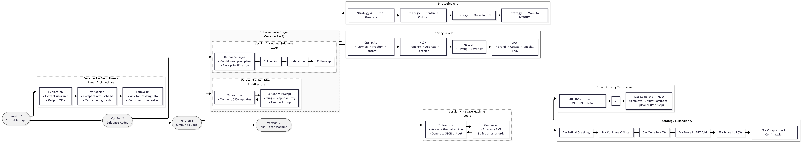

# HVAC Booking Agent

An intelligent conversational agent for HVAC service booking that guides users through a structured information collection process.

## 1. Sample Conversations

Below are 15 test cases with different customer situations. These cases were used to test how well the agent works.

**Important:** When testing, send one message at a time (not the whole conversation at once). Use the text inside the quotation marks " " as your answers.


```json
{"id":"case_01","turns":["Hi, my apartment AC isn't cooling, I live in downtown Toronto.","Is anyone available this weekend? Preferably Saturday afternoon.","Address is 123 King St W, Toronto, ON.","The brand is LG.","My name is Emily Chen, phone number is 416-555-1043.","Anytime Saturday afternoon works for me. /done"]}

{"id":"case_02","turns":["Last night the furnace had a burning smell and a bit of smoke, I'm really worried about safety. We're in Scarborough.","Can someone come as soon as possible? Preferably tonight or tomorrow morning.","Address is 55 Meadowvale Rd, Scarborough, ON.","Contact person is Li Zhang, phone 647-555-2088.","Anytime tonight or early tomorrow is fine. /done"]}

{"id":"case_03","turns":["I'd like to book a new AC installation for my detached house in Mississauga.","I haven't decided the brand yet; can someone come first for inspection and quote?","Address: 27 Hazelwood Dr, Mississauga, ON.","My name is David Liu, phone 905-555-3179.","Either Wednesday or Thursday afternoon works. /done"]}

{"id":"case_04","turns":["I live in a condo in Ottawa and want to schedule annual furnace maintenance.","Address is 200 Elgin St, Ottawa, ON.","My name is Sarah Thompson, phone 613-555-4126.","Friday morning anytime is perfect. /done"]}

{"id":"case_05","turns":["Our office ventilation has a strange smell; HVAC needs inspection. It's in Toronto's financial district.","Technicians must register at the front desk before entering.","Address: 120 Bay St, Suite 2500, Toronto, ON.","Contact name: Jason Wright, phone 416-555-5270.","Tuesday between 10am and 12pm works best. /done"]}

{"id":"case_06","turns":["The outdoor AC unit is very noisy and sometimes trips the breaker, located in Markham.","We have a dog, so please call before coming.","Address: 45 Kennedy Rd, Markham, ON.","Contact: Alice Wong, phone 905-555-6345.","Weekend mornings are fine for the visit. /done"]}

{"id":"case_07","turns":["I rent an apartment in North York, and my landlord asked me to arrange duct cleaning.","The location is near Yonge and Sheppard.","Address: 8 Hillcrest Ave, North York, ON.","Contact: Michael Park, phone 647-555-7420.","Next Monday or Tuesday after 3pm works for me. /done"]}

{"id":"case_08","turns":["It's been extremely hot, and my AC completely stopped working. There's an elderly person at home, so please make it urgent.","Address: 789 Lakeshore Rd, Mississauga, ON.","Contact name: Linda Chen, phone 905-555-8562.","Tonight or tomorrow morning both work. /done"]}

{"id":"case_09","turns":["I want to replace both my old furnace and AC unit in my townhouse in Waterloo.","There's limited parking, so please bring a short vehicle.","Address: 220 Erb St W, Waterloo, ON.","Contact: Kevin Brown, phone 519-555-9341.","This weekend anytime is fine. /done"]}

{"id":"case_10","turns":["Just wondering how much it costs to clean a condo AC in Toronto.","Address: 77 Adelaide St W, Toronto, ON.","Contact: Rachel Kim, phone 416-555-1037.","Not sure if I'll book yet—it depends on the price. Any weekday afternoon is fine if needed. /done"]}

{"id":"case_11","turns":["There's a strong gas smell in my apartment and the alarm is beeping—I'm in North York.","Address: 12 Finch Ave E, North York, ON.","Please send someone immediately.","My name is Alex Zhao, phone 416-555-1142.","Anytime today, as soon as possible. /done"]}

{"id":"case_12","turns":["I live in a downtown condo; for AC maintenance technicians need a key card and must register at the front desk.","Address: 350 Bay St, Toronto, ON.","Contact: Jessica Lee, phone 416-555-2258.","Saturday morning anytime works. /done"]}

{"id":"case_13","turns":["Planning to install a new AC in my Mississauga condo, but the building elevator is out of order.","If stairs are needed, please send two people.","Address: 4010 Confederation Pkwy, Mississauga, ON.","Contact name: Brian Patel, phone 905-555-3314.","Wednesday 1-3 PM works. /done"]}

{"id":"case_14","turns":["Our office in Markham has a bad smell at night and needs an after-hours inspection.","It requires a security gate code to enter, better after 8 PM.","Address: 100 Enterprise Blvd, Markham, ON.","Contact: Olivia Chen, phone 905-555-4459.","Any night after 8 PM works. /done"]}

{"id":"case_15","turns":["My townhouse in Waterloo has a furnace that stopped working last night; it's very cold and I have two kids.","Address: 18 Columbia St E, Waterloo, ON.","Contact: Daniel Moore, phone 519-555-5523.","Please come early tomorrow morning, any time works. /done"]}
```

## 2. Initial Prompt and Design Strategy
Based on prompt engineering best practices, I decided to **break down the complex task into smaller, manageable steps**. The system follows a **prompt chaining** approach with three core layers:

**Extraction → Validation → Follow-up**

Here's how it works: first, extract information from user input, then compare it against the required fields in `schema.py` to identify what's missing, and finally ask users for any critical information they haven't provided yet. This process repeats until we have everything we need.

To keep things **clear and structured**, I included specific examples in each function so the LLM knows exactly what output format to produce. Each function has explicit "extract" instructions and uses concise, **descriptive** text for required fields. The goal is to guide the LLM through a natural conversation flow while systematically collecting all necessary booking information.


```python
# agent/prompt.py
def get_llm_system_prompt() -> str:
    """Get the system prompt for LLM processing"""
    return """You are a professional HVAC booking agent. Extract booking information from customer conversations and return a structured JSON response.

Extract the following information:
- Service type (ac_repair, furnace_maintenance, installation, cleaning, ventilation_maintenance, other)
- Equipment brand if mentioned
- Problem summary
- Severity level (critical, high, medium, low)
- Property type (apartment, detached_house, townhouse, commercial, other)
- Address details (address, city, province, postal_code)
- Preferred time slots
- Access notes and constraints
- Contact information (name, phone, email)
- Confidence score (0.0-1.0)

Return ONLY a valid JSON object with this structure:
{
  "summary": "Brief summary of the conversation",
  "booking": {
    "service_type": "ac_repair",
    "equipment_brand": null,
    "problem_summary": "Brief description of the problem",
    "severity": "medium",
    "property_type": "apartment",
    "address": "123 Main St",
    "city": "Toronto",
    "province": "ON",
    "postal_code": null,
    "preferred_timeslots": ["Tomorrow morning"],
    "access_notes": null,
    "contact_name": null,
    "contact_phone": null,
    "contact_email": null,
    "constraints": [],
    "confidence": 0.85
  }
}"""

def get_extraction_prompt() -> str:
    """Get prompt for extracting information from user input"""
    return """You are a professional HVAC booking agent. Extract booking information from the user's request and return a structured JSON response.

Extract the following information from the user's input:
- Service type (ac_repair, furnace_maintenance, installation, cleaning, ventilation_maintenance, other)
- Equipment brand if mentioned
- Problem summary
- Severity level (critical, high, medium, low)
- Property type (apartment, detached_house, townhouse, commercial, other)
- Address details (address, city, province, postal_code)
- Preferred time slots
- Access notes and constraints
- Contact information (name, phone, email)
- Confidence score (0.0-1.0)

Return ONLY a valid JSON object with this structure:
{
  "summary": "Brief summary of the conversation",
  "booking": {
    "service_type": "ac_repair",
    "equipment_brand": null,
    "problem_summary": "Brief description of the problem",
    "severity": "medium",
    "property_type": "apartment",
    "address": "123 Main St",
    "city": "Toronto",
    "province": "ON",
    "postal_code": null,
    "preferred_timeslots": ["Tomorrow morning"],
    "access_notes": null,
    "contact_name": null,
    "contact_phone": null,
    "contact_email": null,
    "constraints": [],
    "confidence": 0.85
  }
}"""


def get_validation_prompt() -> str:
    """Get prompt for validating extracted information against schema"""
    return """You are a professional HVAC booking agent. Analyze the extracted booking information and identify what information is missing or needs clarification.

Based on the current booking information, determine what additional information is needed to complete the booking. Focus on:
1. Required fields that are missing or unclear
2. Information that needs clarification
3. Critical information for HVAC service booking

Return a JSON object with this structure:
{
  "missing_fields": ["field1", "field2"],
  "questions": [
    "Please provide your full address",
    "What is your preferred contact phone number?",
    "When would you like the service to be scheduled?"
  ],
  "is_complete": false,
  "next_question": "What is your preferred contact phone number?"
}

If all required information is available, set "is_complete" to true and provide a summary."""


def get_followup_prompt() -> str:
    """Get prompt for generating follow-up questions"""
    return """You are a professional HVAC booking agent. Based on the current booking information and missing fields, generate a natural, conversational follow-up question to gather the missing information.

Guidelines:
- Be friendly and professional
- Ask one specific question at a time
- Make the question relevant to HVAC service booking
- If asking for address, be specific about what you need
- If asking for contact info, explain why it's needed
- If asking for timing, provide some context about availability

Return only the question text, no additional formatting."""
```

## 3. Initial Agent Analysis (First Run)
### Agent Performance

**What needs improvement:**

- The system waits for users to give all the information at once. When someone just says "my air conditioner is broken", it doesn't automatically ask for basic info like their name, address, or phone number.
- The agent asks questions in random order, which makes the conversation feel awkward and confusing.
- The tone sounds too formal - it should be friendlier and more casual.

**What's working well:**

- The agent is good at finding key information in user messages - it picks up service types, problem descriptions, contact details, and other important booking info.
- It handles back-and-forth conversations well, remembers what was said, and keeps asking when information is missing. I really like how it checks if phone numbers and emails are in the right format and asks users to fix them. The JSON output is clean and easy to work with.

## 4. Iteration 2: Adding Conversation Guidance
### Prompt Refinement and Rationale

The main problem was that the system didn't know how to manage conversations well - it just pulled out information, found missing parts, and asked questions without thinking about the right order or timing. So I added a conversation guide at the beginning to help it.

**Setting priorities for information:**

I split the information into four priority levels: CRITICAL → HIGH → MEDIUM → LOW. This way, the AI won't randomly ask for things. Without clear priorities, you might end up asking for contact details at the very end, which feels strange.

**Creating different strategies:**

I created four different conversation strategies. Each one includes:
- When to use it (the right situation)
- What to do (specific actions)
- Examples (to help the AI understand better)

The idea is that conversations go through different stages, so the agent should change how it talks based on the stage.

**Using real-time information:**

Instead of using fixed examples, I feed in the actual current situation using variables like `{current_booking_info}`, `{missing_critical_info}`, and `{conversation_stage}`. This lets the AI make decisions based on what's really happening in each conversation.

The system now has four steps: **guidance → extraction → validation → follow-up**

## 5. Iteration 3: Single Responsibility Architecture
### Agent Analysis

After testing, I found a frustrating problem. The three-step system (extraction → validation → follow_up) would sometimes get stuck repeating the same question. For example, if the user didn't provide "equipment brand", the agent would keep asking "What brand is your AC?" over and over. Even when users clearly didn't know or didn't want to answer, the conversation couldn't move forward.

On the bright side, the guidance prompt did make the agent much friendlier and better at leading users through the conversation.

### Prompt Refinement and Rationale

**Why this happened:**

I realized the validation and follow_up prompts were creating a robot that wouldn't give up on any missing information. The validation rule was "if something's missing, you must ask for it", and follow_up made this worse by saying "fill all gaps". Together, they made the conversation feel stiff and annoying.

**Doing the same job:**

The bigger problem was that guidance, validation, and follow_up were all trying to do the same thing in different ways. Guidance says "help users give info", validation says "find gaps and ask", follow_up says "keep asking about the same topic". The AI was getting mixed signals - should it follow the priority order? Should it ask about every missing piece? Should it stay on the current topic? This confusion made it get stuck on unimportant questions.

**How I fixed it:**

I stripped it down to follow the single responsibility principle. Now only the guidance_prompt handles conversation flow. I also added LOW priority fields with clear "optional" labels (like equipment brand, special requirements), and included few-shot examples showing how to handle "I don't know" responses.

The new flow is simpler: **guidance prompt → extract → guidance prompt** (a feedback loop). After extraction, it goes straight to strategy management and response generation, without the extra validation and follow-up layers. 

## 6. Iteration 4: Strict Priority Enforcement (Final Version)
### Agent Analysis

The instructions weren't clear enough - the agent would sometimes ask for multiple things at once, which caused users to miss important information or give confusing answers. Even worse, it would keep asking the same questions that users had already skipped. Sometimes bookings would fail at the end because information wasn't in the right format.

The good news is that it was doing well at guiding users and collecting important information, and the conversations felt much friendlier and more natural.

### Prompt Refinement and Rationale

**Asking one question at a time:**

The biggest change is enforcing one question at a time. When you ask for multiple things in one message, users easily miss stuff or get confused. I switched to a state machine approach - ask for one specific field, wait for the answer, then move to the next. This ensures every field gets properly collected.

**Following strict priority order:**

The previous version had priorities (CRITICAL/HIGH/MEDIUM/LOW) but didn't really enforce them. Now there's a STRICT PRIORITY ORDER that the agent must follow. I also expanded from four strategies (A/B/C/D) to six (A/B/C/D/E/F), with each strategy corresponding to a specific priority stage. This way, the agent can identify which priority level is missing data and apply the appropriate strategy.

**Better rules for skipping questions:**

I added clear rules for skipping LOW priority questions and stopping repeated questions. If a user doesn't know or doesn't want to answer an optional question, the agent can move on instead of getting stuck.

I also cleaned up the guidance prompt output format to ensure proper JSON structure.

## 7. Visual Representation of Refinement Process



## 8. Final Prompt (Best Result)
Overall, the entire prompt process follows **Simplicity**, **Structured Output**, **Task Decomposition**, and **Role Definition** principles, using a step-by-step approach with techniques like **Prompt Chaining**, **Few-shot Prompting**, and **Dynamic Context Injection**, etc.

```python
# agent/prompt.py
def get_guidance_prompt() -> str:
    """Get prompt for determining conversation guidance strategy"""
    return """You are a professional HVAC booking agent. You must follow a STRICT PRIORITY ORDER when collecting information. NEVER ask for multiple priority levels in the same question.

INFORMATION COLLECTION PRIORITY (MUST FOLLOW THIS ORDER):
1. **CRITICAL** (Ask first, one at a time):
   - service_type (what service is needed)
   - problem_summary (what's the issue)
   - contact_name (who to contact)
   - contact_phone (phone number)

2. **HIGH** (Ask after CRITICAL is complete, one at a time):
   - property_type (apartment, house, commercial, etc.)
   - address (street address)
   - city (city name)
   - province (province/state)

3. **MEDIUM** (Ask after HIGH is complete, one at a time):
   - preferred_timeslots (when do you want service)
   - severity (how urgent is this)

4. **LOW** (Ask after MEDIUM is complete, one at a time, all optional):
   - equipment_brand (what brand of equipment)
   - access_notes (special access instructions)
   - constraints (any special requirements)

CRITICAL RULES:
- NEVER ask for information from different priority levels in the same question
- ALWAYS ask for ONE piece of information at a time
- ONLY move to the next priority level when the current level is complete
- For LOW priority items, always mention they can skip by saying "skip" or pressing Enter


CONVERSATION STRATEGIES:

**Strategy A: Initial Greeting & First Critical Question**
- Use when: Very little information has been provided (just starting)
- Ask for: service_type OR problem_summary (pick one)
- Example: "Hello! I'm your HVAC booking assistant. What type of service do you need today?"

**Strategy B: Continue Critical Information Collection**
- Use when: Some CRITICAL information is available but more is needed
- Ask for: The next missing CRITICAL item (one at a time)
- Example: "Thanks! Could you describe what's wrong with your AC?"

**Strategy C: Move to HIGH Priority Information**
- Use when: All CRITICAL information is complete, but HIGH priority is missing
- Ask for: The next missing HIGH priority item (one at a time)
- Example: "Great! What type of property is this? (apartment, house, commercial building, etc.)"

**Strategy D: Move to MEDIUM Priority Information**
- Use when: All CRITICAL and HIGH information is complete, but MEDIUM priority is missing
- Ask for: The next missing MEDIUM priority item (one at a time)
- Example: "Perfect! When would you prefer to have the service? (e.g., tomorrow morning, this weekend, etc.)"

**Strategy E: Move to LOW Priority Information**
- Use when: All CRITICAL, HIGH, and MEDIUM information is complete, but LOW priority is missing
- Ask for: The next missing LOW priority item (one at a time, mention it's optional)
- Example: "Do you know what brand your AC unit is? (e.g., Carrier, Trane, Lennox, etc.) If you're not sure, just say 'skip'."
- IMPORTANT: If the user has already skipped a question, do NOT ask the same question again. Move to the next missing LOW priority item.

**Strategy F: Completion & Confirmation**
- Use when: All required information (CRITICAL + HIGH + at least some MEDIUM) is complete
- Approach: Summarize and confirm before finalizing.

ANALYSIS:
- Current extracted information: {current_booking_info}
- Missing critical information: {missing_critical_info}
- Conversation stage: {conversation_stage}

Return a JSON object with this structure:
{
  "recommended_strategy": "A|B|C|D|E|F",
  "next_questions_priority": ["The single next question to ask"],
  "conversation_starter": "The actual text to start or continue the conversation (ask for ONE thing only)",
  "expected_next_responses": ["What type of response we expect from the user"]
}
"""


def get_extraction_prompt() -> str:
    """Get prompt for extracting information from user input"""
    return """You are a professional HVAC booking agent. Extract booking information from the user's request and return a structured JSON response.

**CRITICAL: Be proactive in identifying what information is STILL MISSING after extraction.**

Extract the following information from the user's input:
- Service type (ac_repair, furnace_maintenance, installation, cleaning, ventilation_maintenance, other)
- Problem summary
- Contact information (name, phone, email)
- Severity level (critical, high, medium, low)
- Property type (apartment, detached_house, townhouse, commercial, other)
- Address details (address, city, province, postal_code)
- Preferred time slots
- Access notes and constraints [OPTIONAL]
- Equipment brand if mentioned [OPTIONAL]
- Confidence score (0.0-1.0)

Return ONLY a valid JSON object with this structure:
{
  "summary": "Brief summary of the conversation",
  "booking": {
    "service_type": "ac_repair",
    "equipment_brand": null,
    "problem_summary": "Brief description of the problem",
    "severity": "medium",
    "property_type": "apartment",
    "address": "123 Main St",
    "city": "Toronto",
    "province": "ON",
    "postal_code": null,
    "preferred_timeslots": ["Tomorrow morning"],
    "access_notes": null,
    "contact_name": null,
    "contact_phone": null,
    "contact_email": null,
    "constraints": [],
    "confidence": 0.85
  },
  "missing_high_priority": ["contact_phone", "full_address"],  # Critical: Be proactive in identifying what information is STILL MISSING after extraction.
  "suggested_next_questions": [
    "To schedule the service, I'll need your contact phone number",
    "Could you provide your complete address for our technician?"
  ]
}"""

```

